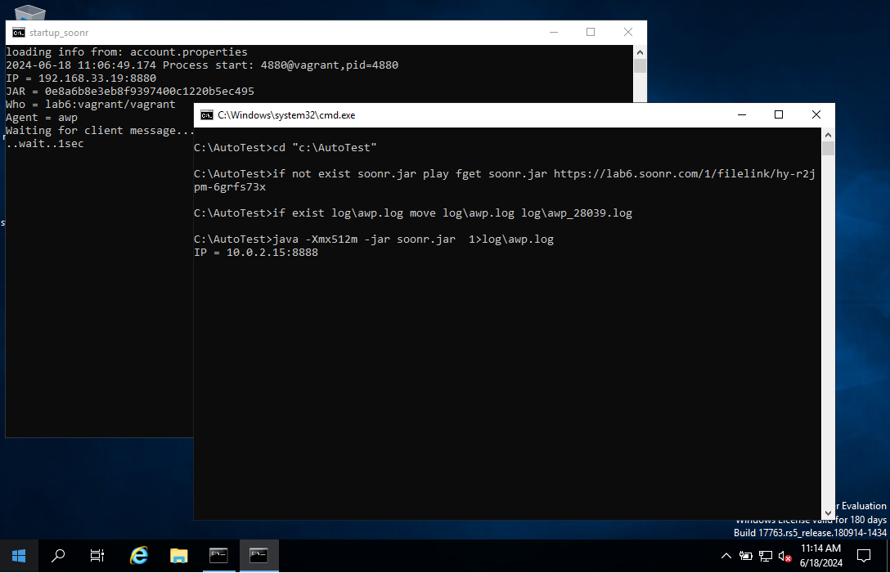

##Deploying VirtualBox virtual machines with Vagrant

## VM provision via vagrant with virtualbox
* ubuntu/jammy64 : 192.168.33.12
* gusztavvargadr/windows-10 : 192.168.33.10
* StefanScherer/windows_2019 : 192.168.33.19

## Setup Autologin using default account for windows

* username= vagrant
* password= vagrant

## Provision scripts [setup.ps1]

* Install Java 8.0 & .NET 6.0
* Launch 3 Process for remote control and Automation:
 1. System Service process (port 23)
 2. Administrator privileges process (port 8888)
 3. Normal Users process(port 8880)

## Screenshots - Example

